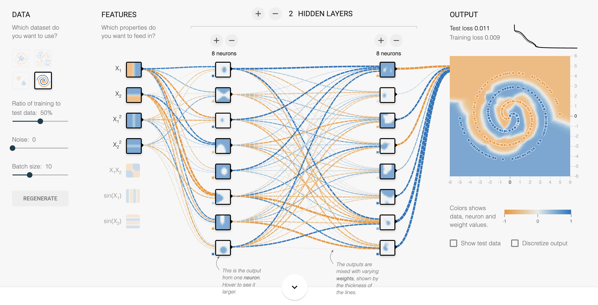
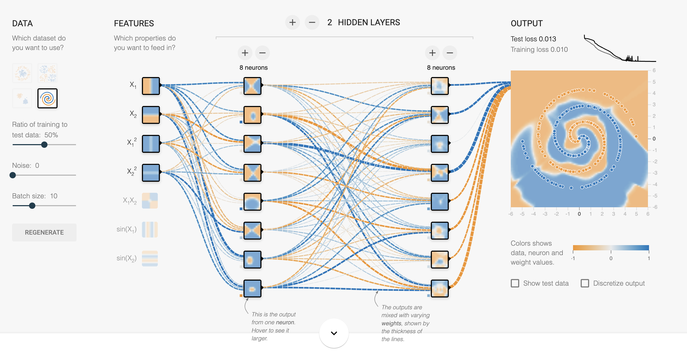
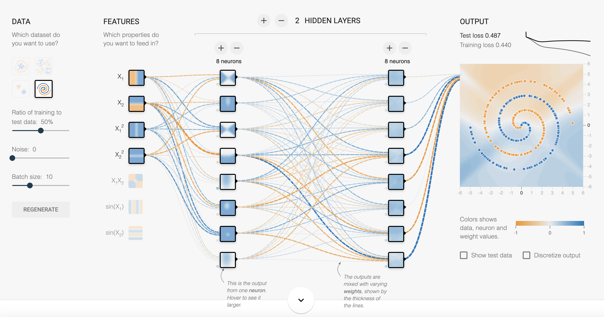
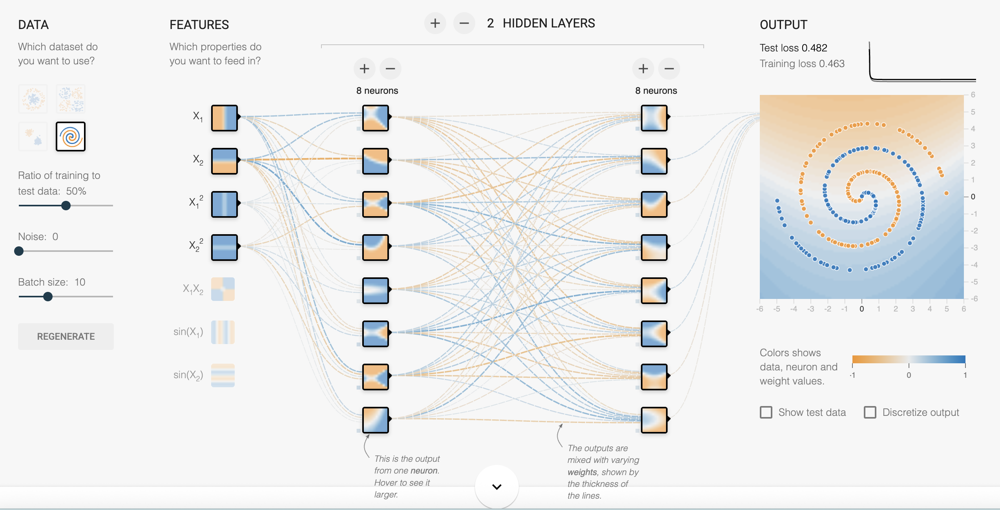
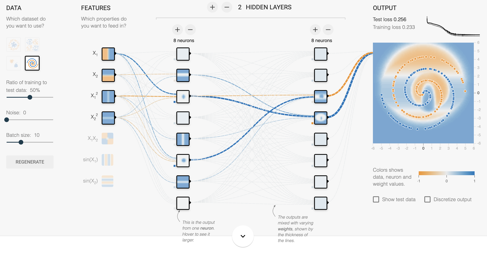
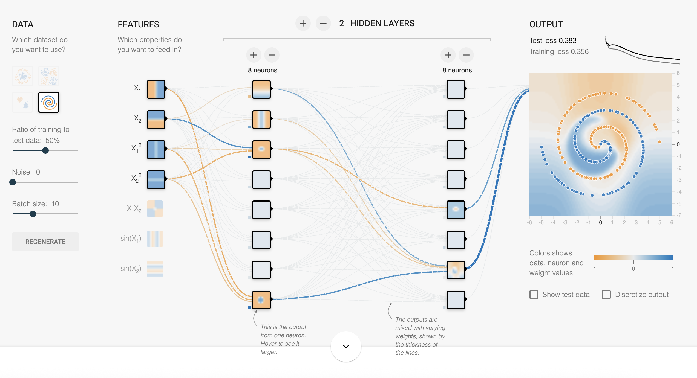
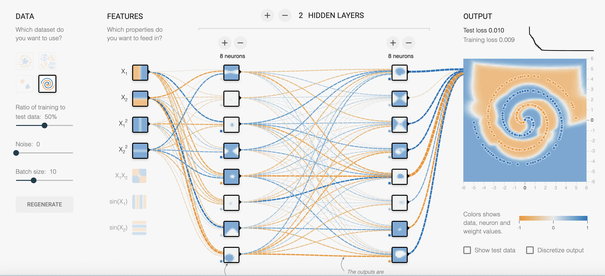
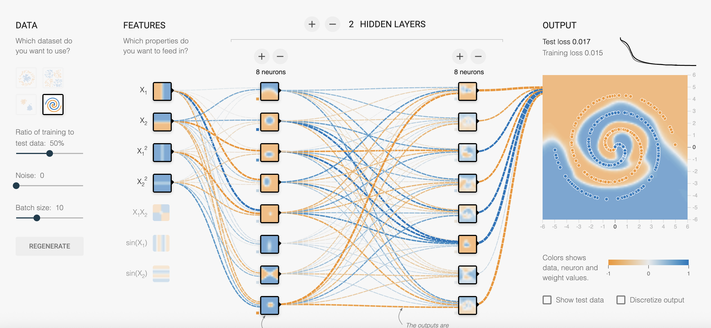

# Exercise 3
## 3.1
### Experiment
For this first problem, I tested all of *ReLU, Tanh, Sigmoid and Linear*. As the **Spiral** dataset cannot be linearly separable, it is also intuitive to think about project the features to higher-dimensional planes by $X_1^2, X_2^2$ to obtain better results.

- ReLU w\o Regularization

- Tanh w\o Regularization

- Sigmoid w\o Regularization

- Linear w\o Regularization

For this part, I run 1000 epochs on the training dataset for each activation function. It is made apparent from the screenshots above that **ReLU and Tanh** outperform the other activation functions on Spiral dataset.

### Insights
Observations on the result:
- With the quaratic input features, the classifier converges faster and gives a smoother decision boundary;
- Under the same setting, *ReLU* converges faster than *Tanh*, whilst *Tanh* has a smoother decision boundary.

Some facts:
- *ReLU* is not confronted with problems like **Gradient Vanishing** and has a smaller computation overhead, as its expression is quite simple;
- The form of *Tanh* has good symmetric property, thus working well with this **Spiral** dataset.

## 3.2
For this part I only test ReLU and Tanh, which win the **3.1 Contest**.

### Experiment L1 Regularization
- ReLU

- Tanh

### Experiment L2 Regularization
The results of the experiments w\ L2 Regularization are given below:

- ReLU

- Tanh

### Insights
1. For L1 Regularization, the promotion of **sparsity** is manifest from the graphs (only a few lines connecting each layers are thick, the others thinner);
2. If we compare the ReLU or Tanh w\o regularization with those w\ regularization, we can note that the former ones give thicker lines overall;
3. For the **Spiral** dataset, the performance of regularization on the loss is approximately: $L_2\approx \text{No Regularization}>>L_1$.

The possible reason for **3.** is that when L1 Regularization is applied, the weights are likely to be more uneven. (As is mentioned in **1.**) However, the curve of our **Spiral** dataset is smooth and symmetric. As a consequence, L1 regularization sees a worse performance in this problem.